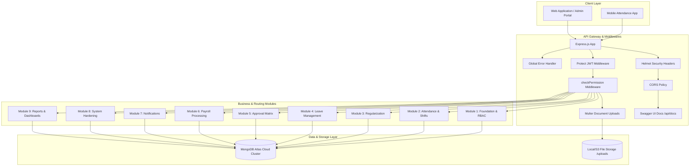

# NexAlliance HRM - System Architecture Overview

## 1. High-Level Architectural Pattern

The **NexAlliance HRM Backend** is designed around a **Modular, Service-Oriented MVC Architecture** on Node.js and MongoDB.



---

## 2. Key Architecture Pillars

### 2.1 Master-Driven Configuration
- Hardcoded constants in business logic are eliminated.
- Organization structures (Departments, Designations, Branches) and System Access rules (Roles, Permissions) are stored in database collections and manageable via Super Admin UI screens.

### 2.2 Connection Reliability & Caching
The database connection manager ([`config/db.js`](file:///d:/NexAllince/NexAlliance-HRM/config/db.js)) implements:
- **Global Connection Caching**: Reuses active Mongoose connections across hot-reloads and serverless runs.
- **Connection Pooling**: `maxPoolSize: 10`, `minPoolSize: 1` with 30-second socket timeouts.
- **DNS Server Fallback**: Configured with Google & Cloudflare DNS (`8.8.8.8`, `1.1.1.1`) to resolve Atlas SRV records seamlessly on corporate and ISP networks.

### 2.3 Role Hierarchy & Security Matrix

```
Level 3: SUPER_ADMIN (Full company-wide access, bypasses matrix checks, protected invariant)
   │
   ├── Level 2: CEO & CTO (Identical high-level company-wide visibility, read-only masters)
   │
   └── Level 1: EMPLOYEE (Self-service scope OWN, limited whitelisted profile updates)
```

---

## 3. Directory Layout

```
NexAlliance-HRM/
├── .env                       # Environment variables
├── package.json               # Dependencies & scripts
├── server.js                  # Main server entrypoint
├── config/
│   ├── db.js                  # Database connection manager
│   └── swagger.js             # Swagger OpenAPI 3.0 specification
├── models/
│   ├── Role.js                # Role Master
│   ├── Permission.js          # Static permission actions
│   ├── RolePermission.js      # Dynamic Role-Permission Matrix
│   ├── Department.js          # Department hierarchy
│   ├── Designation.js         # Designation levels
│   ├── Branch.js              # Location & Geofencing master
│   ├── User.js                # Employee Master (Bank, KYC, Marksheets)
│   └── AuditLog.js            # Audit Logging
├── middlewares/
│   ├── auth.js                # JWT verify + RBAC permission checker
│   ├── upload.js              # Multer document upload handler
│   └── errorHandler.js        # Global error interceptor
├── controllers/
│   ├── authController.js
│   ├── roleController.js
│   ├── permissionMatrixController.js
│   ├── departmentController.js
│   ├── designationController.js
│   ├── branchController.js
│   ├── employeeController.js
│   └── auditLogController.js
├── routes/
│   ├── authRoutes.js
│   ├── roleRoutes.js
│   ├── permissionMatrixRoutes.js
│   ├── departmentRoutes.js
│   ├── designationRoutes.js
│   ├── branchRoutes.js
│   ├── employeeRoutes.js
│   └── auditLogRoutes.js
├── scripts/
│   ├── seed.js                # Idempotent database seeder
│   └── test_api.js            # Automated integration test suite
├── docs/
│   ├── MODULE_1_FOUNDATION.md # Detailed Module 1 PRD & Guide
│   ├── ARCHITECTURE_OVERVIEW.md
│   ├── API_COLLECTION.md      # API Reference Cheat-sheet
│   └── SETUP_GUIDE.md         # Developer Setup Guide
└── uploads/                   # Statically served file uploads
    ├── photos/
    └── documents/
```
