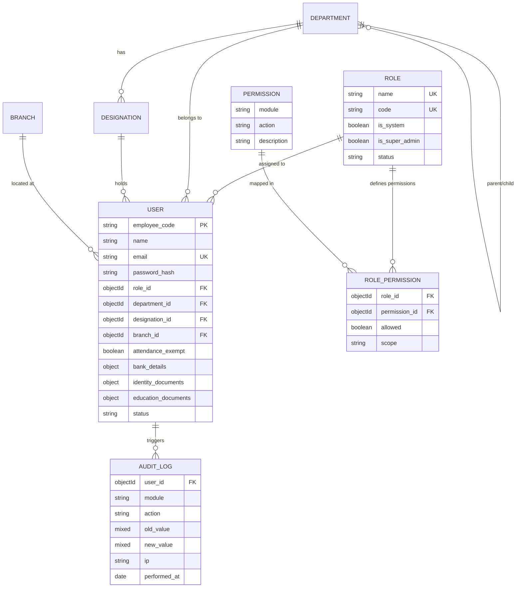
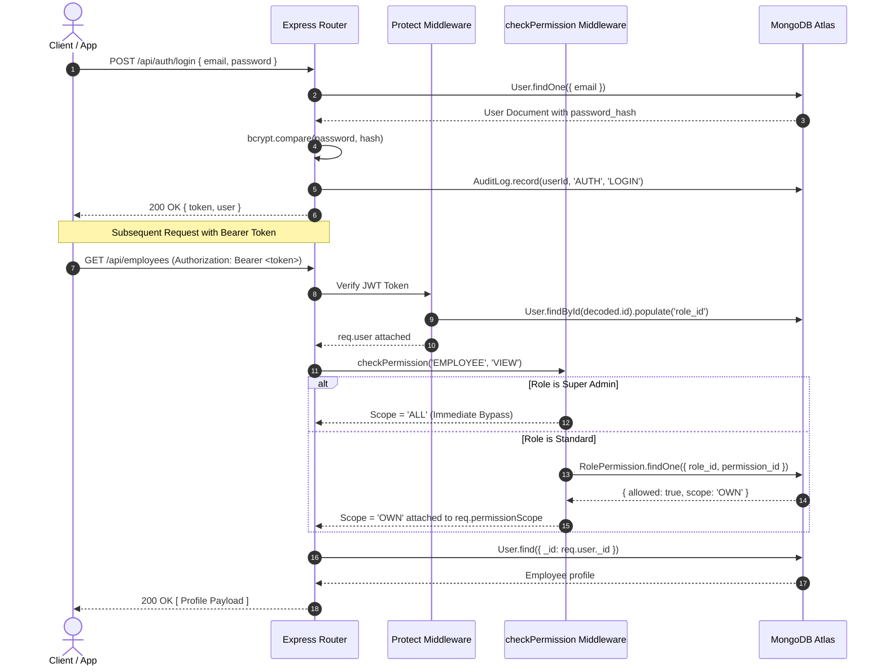

# NexAlliance HRM - Module 1: Foundation Layer Documentation

## 1. Introduction & Overview

**Module 1 (Foundation)** provides the core architectural backbone for the **NexAlliance Enterprise HRM System**. Every subsequent module (Attendance, Regularization, Leave Management, Payroll, Reporting, etc.) directly relies on the data models, role-based access control (RBAC), permission matrix, and audit logging infrastructure introduced in this module.

### Core Philosophy: Everything Master-Driven, Nothing Hardcoded
Per system specifications:
- **Zero Hardcoding**: Roles, Permissions, Departments, Designations, Branches, and Approval hierarchies are dynamically maintained in MongoDB database collections.
- **Dynamic Permission Matrix**: Every Role is bound to granular `(Module, Action, Scope)` permission mappings.
- **Safe Soft Deactivations**: Organization masters are marked `status: 'Inactive'`, preserving historical referential integrity.
- **Super Admin Invariant**: Super Admin bypasses permission matrix checks automatically. The system strictly prevents deactivating or demoting the last active Super Admin.

---

## 2. System Architecture & Entity Relationship Diagram

---

## 3. Detailed Data Schemas

### 3.1 User / Employee Master (`models/User.js`)
Stores company employees, login credentials, organization linkages, bank information, KYC identity cards, and educational marksheets.

| Field | Type | Description |
|---|---|---|
| `employee_code` | String (Unique, Indexed) | Unique employee ID (e.g. `NEX-0001`, `EMP1002`) |
| `name` | String | Full name |
| `email` | String (Unique, Indexed) | Official corporate email address |
| `password_hash` | String | Bcrypt hashed password (10 rounds) |
| `role_id` | ObjectId (Ref: Role) | Assigned system or custom role |
| `department_id` | ObjectId (Ref: Department) | Assigned department |
| `designation_id`| ObjectId (Ref: Designation)| Assigned designation |
| `branch_id` | ObjectId (Ref: Branch) | Work location branch |
| `shift_id` | ObjectId (Ref: Shift) | Assigned shift (Module 2 forward link) |
| `dob` | Date / String (DD/MM/YYYY) | Date of Birth (formatted as `DD/MM/YYYY` via `dob_formatted`) |
| `date_of_joining` | Date / String (DD/MM/YYYY) | Joining date (formatted as `DD/MM/YYYY` via `doj_formatted`) |
| `salary` | Number | Monthly Gross / CTC Salary (e.g. `50000`) |
| `phone` | String | Mobile number |
| `address` | String | Residential address |
| `emergency_contact` | String | Emergency contact phone/person |
| `photo_url` | String | Profile photo URL |
| `attendance_exempt` | Boolean | True for Super Admin (`no clock-in required`) |
| **`bank_details`** | Object | Employee Bank Details (for Payroll) |
| ↳ `account_holder_name` | String | Name as per Bank records |
| ↳ `account_number` | String | Bank account number |
| ↳ `bank_name` | String | Bank Name (e.g. HDFC, SBI, ICICI) |
| ↳ `ifsc_code` | String | IFSC Code |
| ↳ `branch_name` | String | Bank branch name |
| ↳ `upi_id` | String | Optional UPI ID |
| **`identity_documents`** | Object | Government Identity & KYC |
| ↳ `aadhar_number` | String | Aadhaar Card Number (12 digits) |
| ↳ `aadhar_card_url` | String | Uploaded Aadhaar card copy URL |
| ↳ `pan_number` | String | Permanent Account Number (PAN) |
| ↳ `pan_card_url` | String | Uploaded PAN card copy URL |
| **`education_documents`** | Object | Academic Credentials |
| ↳ `tenth_marksheet_url` | String | 10th Standard Marksheet URL |
| ↳ `twelfth_marksheet_url` | String | 12th Standard Marksheet URL |
| ↳ `diploma_marksheet_url` | String | Diploma Marksheet URL |
| ↳ `graduation_certificate_url`| String | Degree / Graduation Certificate URL |
| ↳ `other_documents` | Array | Extra certifications `[{ title, file_url }]` |
| `status` | Enum | `'Active'` or `'Inactive'` |

---

### 3.2 Role Master (`models/Role.js`)
| Field | Type | Description |
|---|---|---|
| `name` | String (Unique) | Role name (e.g., `Super Admin`, `CEO`, `Employee`) |
| `code` | String (Unique) | Upper-case code (`SUPER_ADMIN`, `CEO`, `CTO`, `EMPLOYEE`) |
| `is_system` | Boolean | `true` for 4 seeded roles (cannot be deleted) |
| `is_super_admin` | Boolean | `true` for Super Admin (triggers bypass) |
| `status` | Enum | `'Active'` or `'Inactive'` |

---

### 3.3 Permission Catalog (`models/Permission.js`)
Static catalog of modules and actions with unique compound index `{ module: 1, action: 1 }`.

**Modules:** `EMPLOYEE`, `MASTERS`, `ROLE`, `PERMISSION_MATRIX`, `ATTENDANCE`, `REGULARIZATION`, `LEAVE`, `PAYROLL`, `REPORTS`, `SETTINGS`, `AUDIT`.

**Actions:** `VIEW`, `CREATE`, `EDIT`, `DELETE`, `CLOCK_IN`, `CLOCK_OUT`, `APPLY`, `APPROVE`, `REJECT`, `PROCESS`, `GENERATE`, `EXPORT`.

---

### 3.4 Role-Permission Matrix (`models/RolePermission.js`)
| Field | Type | Description |
|---|---|---|
| `role_id` | ObjectId (Ref: Role) | Target role |
| `permission_id` | ObjectId (Ref: Permission) | Target permission |
| `allowed` | Boolean | Permission granted or denied |
| `scope` | Enum | `'OWN'`, `'DEPT'`, `'ALL'`, `'MATRIX'`, `'N/A'`, `'NO'` |

---

### 3.5 Organization Masters (`Department`, `Designation`, `Branch`)
- **Department**: `name`, `code`, `head` (Ref: User), `parent_id` (Ref: Department), `status`.
- **Designation**: `name`, `code`, `department_id` (Ref: Department), `level` (Number), `status`.
- **Branch**: `name`, `address`, `latitude`, `longitude`, `radius_m` (Geofence radius in meters), `timezone`, `status`.

---

### 3.6 System Audit Log (`models/AuditLog.js`)
Records all mutations across the application:
- `user_id`: Performer user ID
- `module`: Target module (e.g., `EMPLOYEE`, `MASTERS`, `ROLE`, `AUTH`)
- `action`: Specific action (e.g., `CREATE`, `UPDATE`, `DEACTIVATE`, `UPLOAD_DOCUMENTS`, `LOGIN`)
- `old_value`: Previous snapshot
- `new_value`: New snapshot
- `ip`: Request IP address
- `performed_at`: Timestamp (indexed)

---

## 4. End-to-End System Workflows

### 4.1 Authentication & Authorization Flow

---

### 4.2 Employee Creation & Document Upload Workflow

1. **Super Admin Creation**:
   - Super Admin submits `POST /api/employees` with official details, initial bank details, and identification numbers.
   - Password is automatically hashed using bcrypt.
   - `AuditLog` entry is created.
2. **Document & Marksheet Upload**:
   - Employee or Super Admin uploads identity & educational files via `POST /api/employees/:id/upload-documents` (multipart/form-data).
   - Supported fields:
     - `photo`: Profile photo (JPG/PNG/WEBP).
     - `aadhar_card`: Aadhaar Card (PDF/Image).
     - `pan_card`: PAN Card (PDF/Image).
     - `tenth_marksheet`: 10th Standard Marksheet.
     - `twelfth_marksheet`: 12th Standard Marksheet.
     - `diploma_marksheet`: Diploma Marksheet.
     - `graduation_certificate`: College / Degree certificate.
   - Files are securely streamed and stored in **Cloudinary Cloud Storage** (under `nexalliance_hrm/documents` and `nexalliance_hrm/photos`) and secure CDN URLs (`https://res.cloudinary.com/...`) are saved directly to the user's database document.
3. **Employee Self-Service Profile Update**:
   - Employee can edit personal fields (`phone`, `address`, `emergency_contact`, `bank_details`).
   - Server-side whitelist **silently ignores and strips** restricted fields (`role_id`, `employee_code`, `department_id`, `designation_id`, `branch_id`, `status`).

---

## 5. API Reference Summary

Interactive Swagger Documentation is live at:
👉 **`http://localhost:5000/api/docs`**

### Auth Endpoints
| Method | URL | Description |
|---|---|---|
| `POST` | `/api/auth/login` | Login with email & password -> returns JWT token |
| `GET` | `/api/auth/me` | Fetch currently authenticated user |
| `GET` | `/api/auth/me/permissions` | Fetch resolved permission matrix for current user |

### Role Master Endpoints
| Method | URL | Description |
|---|---|---|
| `GET` | `/api/roles` | List all system and custom roles |
| `POST` | `/api/roles` | Create new custom role (Super Admin only) |
| `GET` | `/api/roles/:id` | Get role details |
| `PUT` | `/api/roles/:id` | Update role name / status |
| `DELETE` | `/api/roles/:id` | Deactivate custom role (System roles protected) |

### Permission Matrix Endpoints
| Method | URL | Description |
|---|---|---|
| `GET` | `/api/permission-matrix/:roleId` | View permission matrix for a role |
| `PUT` | `/api/permission-matrix/:roleId` | Update role permissions and scopes |

### Organization Masters (`/api/departments`, `/api/designations`, `/api/branches`)
| Method | URL | Description |
|---|---|---|
| `GET` | `/api/departments` / `/designations` / `/branches` | List master records |
| `POST` | `/api/departments` / `/designations` / `/branches` | Create new master record |
| `PUT` | `/api/departments/:id` / ... | Update master record |
| `DELETE` | `/api/departments/:id` / ... | Soft-deactivate master record |

### Employee Master Endpoints
| Method | URL | Description |
|---|---|---|
| `GET` | `/api/employees` | List employees (Scope-enforced: ALL / DEPT / OWN) |
| `GET` | `/api/employees/:id` | Get full employee profile including Bank, KYC & Marksheets |
| `POST` | `/api/employees` | Create employee (Super Admin only) |
| `PUT` | `/api/employees/:id` | Update employee profile (Whitelisted for Employee) |
| `POST` | `/api/employees/:id/upload-documents` | Upload Aadhaar, PAN, 10th, 12th/Diploma marksheets |
| `DELETE` | `/api/employees/:id` | Deactivate employee (Guarded against last Super Admin) |

### Audit Log Endpoints
| Method | URL | Description |
|---|---|---|
| `GET` | `/api/audit-logs` | Filter & paginate audit logs (`user_id`, `module`, `action`, `from`, `to`) |

---

## 6. Downstream Integration (Modules 2 - 9)

Module 1 provides shared services consumed unchanged by all downstream modules:
1. **Module 2 (Attendance)**:
   - Consumes `User.branch_id` for geofence validation (`latitude`, `longitude`, `radius_m`).
   - Consumes `User.shift_id` for shift start/end comparisons.
   - Honors `User.attendance_exempt === true` (bypasses clock-in requirement for Super Admin).
2. **Module 3 (Regularization)**:
   - Uses `checkPermission('REGULARIZATION', 'APPLY')` for employee submission.
   - Routes requests to Super Admin approvers.
3. **Module 4 (Leave Management)**:
   - Uses `checkPermission('LEAVE', 'APPLY')`.
   - Resolves `MATRIX` scope via department reporting hierarchy.
4. **Module 6 (Payroll)**:
   - Directly reads `User.bank_details` (`account_number`, `ifsc_code`, `bank_name`, `account_holder_name`) for salary disbursement and payslip generation.
5. **All Modules**:
   - Every write operation calls `AuditLog.record(userId, module, action, oldValue, newValue, req)`.
