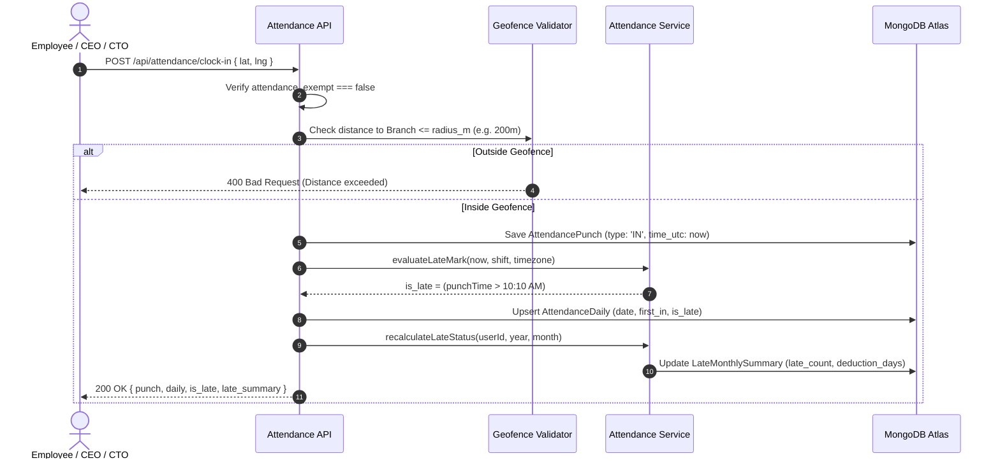
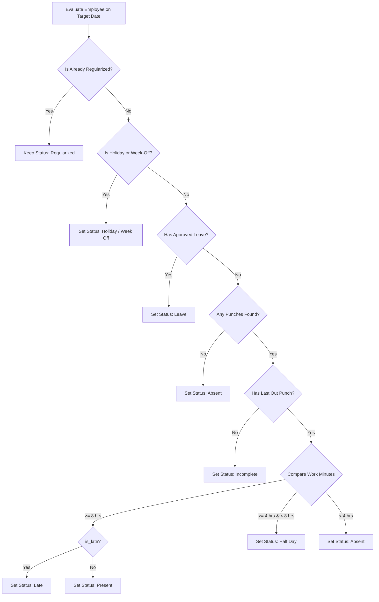

# NexAlliance HRM - Module 2: Attendance Engine Documentation

## 1. Introduction & Overview

**Module 2 (Attendance)** provides the real-time time-tracking, shift policy enforcement, monthly late calculations, and automated end-of-day attendance status reconciliation for the **NexAlliance Enterprise HRM System**.

### Core Architecture: Append-Only Punches + Derived Daily State
1. **`AttendancePunch`**: Immutable, append-only raw punch records (`IN` / `OUT`), storing timestamps in UTC with latitude, longitude, and client source.
2. **`AttendanceDaily`**: One derived summary row per user per date. This is the official state record referenced by **Module 3 (Regularization)**, **Module 4 (Leave)**, and **Module 6 (Payroll)**.
3. **`LateMonthlySummary`**: Rolling monthly late marks counter (`late_count`, `allowed`, `extra_lates`, `deduction_days`), recalculated whenever any daily late flag changes.

---

## 2. Shift & Late Policy Specifications

### 2.1 Default General Day Shift
- **Shift Timings**: `10:00 AM` to `6:30 PM` (8 hours 30 minutes).
- **Grace Period**: `10 minutes` (`grace_in_min: 10`).
  - Clock-in at or before `10:10 AM` $\rightarrow$ **On-Time** (`is_late: false`).
  - Clock-in at `10:11 AM` or later $\rightarrow$ **Late Mark** (`is_late: true`).
- **Monthly Free Allowance**: First `3` late marks per calendar month are permitted without deduction (`monthly_late_allowed: 3`).
- **Late Penalty Policy (From 4th Late Mark)**:
  - Action: `DEDUCT`
  - Rate: `0.5` days Loss of Pay (LOP) per extra late mark beyond 3.
  - Formula:
    $$\text{extra\_lates} = \max(0, \text{late\_count} - 3)$$
    $$\text{deduction\_days} = \text{extra\_lates} \times 0.5$$

---

## 3. Clock-In & End-of-Day State Machine

---

## 4. End-of-Day Daily Status Reconciliation Job

A daily job (`runDailyStatusJob`) evaluates every active, non-exempt employee's daily status using the following strict precedence rules:

---

## 5. API Reference Summary

Interactive Swagger Docs live at: 👉 **`http://localhost:5000/api/docs`**

### 5.1 Shift Master APIs
| Method | URL | Access | Description |
|---|---|---|---|
| `GET` | `/api/shifts` | All Auth | List shift policies |
| `POST` | `/api/shifts` | Super Admin | Create shift with grace & deduction rules |
| `PUT` | `/api/shifts/:id` | Super Admin | Update shift policy |
| `DELETE` | `/api/shifts/:id` | Super Admin | Soft-deactivate shift |

### 5.2 Holiday Calendar APIs
| Method | URL | Access | Description |
|---|---|---|---|
| `GET` | `/api/holidays` | All Auth | List holidays (Filter by year, month, branch) |
| `POST` | `/api/holidays` | Super Admin | Add holiday or weekly-off |
| `PUT` | `/api/holidays/:id` | Super Admin | Update holiday |
| `DELETE` | `/api/holidays/:id` | Super Admin | Soft-deactivate holiday |

### 5.3 Attendance Engine APIs
| Method | URL | Access | Description |
|---|---|---|---|
| `POST` | `/api/attendance/clock-in` | Employee, CEO, CTO | Clock In with geofence & late check |
| `POST` | `/api/attendance/clock-out` | Employee, CEO, CTO | Clock Out & calculate work hours |
| `GET` | `/api/attendance` | Scoped (`ALL`/`DEPT`/`OWN`) | View daily attendance records |
| `GET` | `/api/attendance/late-summary` | Scoped | Get monthly late counter & LOP deduction days |
| `GET` | `/api/attendance/export` | Super Admin, CEO, CTO | Export attendance report (CSV / JSON) |
| `PUT` | `/api/attendance/:userId/:date` | Super Admin | Manual Admin Override (recalculates late counter) |
| `POST` | `/api/attendance/run-daily-job` | Super Admin | Trigger End-of-Day reconciliation job |

---

## 6. Downstream Integration (Modules 3, 4, 6)

1. **Module 3 (Regularization)**:
   - Queries `AttendanceDaily` where `status IN ['Incomplete', 'Absent', 'Late']`.
   - When Super Admin approves a regularization request, Module 3 updates `AttendanceDaily.first_in` and calls `recalculateLateStatus(userId, year, month)` exported by Module 2.
2. **Module 4 (Leave & Short Leave)**:
   - The reconciliation job checks `isOnApprovedLeave(userId, date)` before marking absence.
   - Approved Short Leave calls `markShortLeaveCover(userId, date, fromTime, toTime)` to waive late marks for that specific time window.
3. **Module 6 (Payroll)**:
   - Reads `LateMonthlySummary.deduction_days` directly for LOP calculations:
     $$\text{Total LOP Days} = \text{Absent Days} + \text{Unpaid Leave Days} + \text{deduction\_days}$$
