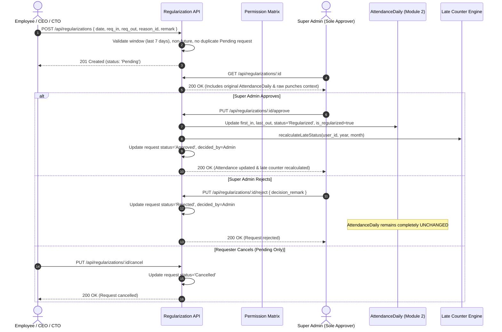

# NexAlliance HRM - Module 3: Attendance Regularization Documentation

## 1. Introduction & Overview

**Module 3 (Regularization)** establishes a dedicated, audited correction layer for attendance records across the **NexAlliance Enterprise HRM System**. 

### 1.1 Key Architectural Rules
1. **Super Admin is the SOLE Approver**: Regularization requests route exclusively to Super Admin. No other role (including CEO and CTO) can approve or reject a regularization request.
2. **Read-Only Executive Visibility**: CEO and CTO can view all regularization requests across the company (scope: `ALL`), but any approval/rejection attempt by CEO/CTO returns `403 Forbidden`.
3. **No Parallel Attendance Schema**: This module does NOT create a competing attendance table. Upon approval, it writes the corrected timestamps directly into Module 2's `AttendanceDaily` record (`status: 'Regularized'`, `is_regularized: true`).
4. **Immutable Punch Logs**: Raw punch logs in `AttendancePunch` are NEVER modified or deleted. Original clock-in and clock-out timestamps remain intact for compliance auditing.
5. **Automated Late-Counter Recalculation**: On approval, the system invokes Module 2's `recalculateLateStatus()` function as the single source of truth. If a corrected clock-in time moves earlier than `10:10 AM`, the late flag is cleared and monthly deduction days are updated automatically.

---

## 2. Regularization Workflow State Machine

---

## 3. Database Schema

### 3.1 `RegularizationReason` (`models/RegularizationReason.js`)
Master catalog of valid regularization categories.

| Field | Type | Required | Description |
|---|---|---|---|
| `_id` | ObjectId | Yes | Auto-generated ID |
| `reason` | String | Yes (Unique) | Name of reason (e.g. `Forgot to Clock In / Out`, `Biometric Issue`) |
| `status` | String (Enum) | Yes | `'Active'` or `'Inactive'` (default: `'Active'`) |
| `createdAt` / `updatedAt` | Date | Auto | Timestamps |

### 3.2 `RegularizationRequest` (`models/RegularizationRequest.js`)
Correction request lifecycle record.

| Field | Type | Required | Description |
|---|---|---|---|
| `_id` | ObjectId | Yes | Auto-generated ID |
| `user_id` | ObjectId (Ref: `User`) | Yes | Requester employee ID |
| `date` | Date (UTC midnight) | Yes | Target date being regularized |
| `req_in` | Date | Yes | Requested In-Time timestamp |
| `req_out` | Date | Yes | Requested Out-Time timestamp |
| `reason_id` | ObjectId (Ref: `RegularizationReason`) | Yes | Master reason ID |
| `remark` | String | No | Requester description / justification |
| `status` | String (Enum) | Yes | `'Pending'`, `'Approved'`, `'Rejected'`, `'Cancelled'` |
| `decided_by` | ObjectId (Ref: `User`) | No | Super Admin who approved/rejected |
| `decision_remark` | String | No | Approver remark (Mandatory on reject) |
| `decided_at` | Date | No | Decision timestamp |

---

## 4. API Endpoints & Access Control Matrix

| HTTP Method | Route | Access Level | Description |
|---|---|---|---|
| `GET` | `/api/regularization-reasons` | All Authenticated | View active regularization reasons |
| `POST` | `/api/regularization-reasons` | `SUPER_ADMIN` | Create new regularization reason |
| `PUT` | `/api/regularization-reasons/:id` | `SUPER_ADMIN` | Update regularization reason |
| `DELETE` | `/api/regularization-reasons/:id` | `SUPER_ADMIN` | Soft-deactivate reason (`status: 'Inactive'`) |
| `POST` | `/api/regularizations` | `EMPLOYEE`, `CEO`, `CTO` (`OWN`) | Submit regularization request (Super Admin gets `403`) |
| `GET` | `/api/regularizations` | `SUPER_ADMIN` / `CEO` / `CTO` (`ALL`), `EMPLOYEE` (`OWN`) | List requests with scope enforcement |
| `GET` | `/api/regularizations/:id` | Matrix Scoped | Request details with original punches & attendance context |
| `PUT` | `/api/regularizations/:id/approve` | `SUPER_ADMIN` ONLY | Approve request, set `Regularized`, recalculate late summary |
| `PUT` | `/api/regularizations/:id/reject` | `SUPER_ADMIN` ONLY | Reject request (Mandatory `decision_remark`) |
| `PUT` | `/api/regularizations/:id/cancel` | Requester ONLY | Cancel own pending request |
