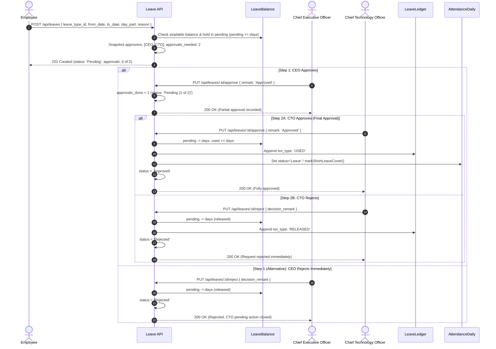

# NexAlliance HRM - Module 4: Leave Management Documentation

## 1. Introduction & Overview

**Module 4 (Leave Management)** implements the enterprise leave lifecycle, balance and ledger tracking, and the system's first **Dual CEO+CTO Approval Workflow** for the **NexAlliance Enterprise HRM System**.

### 1.1 Core Principles & Architecture
1. **Hold-Then-Deduct Balance Engine**:
   - Applying for leave does NOT prematurely increment `used`.
   - The requested days are held in `LeaveBalance.pending`.
   - Only when **BOTH** designated approvers have approved is the quantity deducted from `pending` and added to `used`.
   - Rejections or cancellations immediately release the held `pending` balance.
2. **Dual CEO+CTO Approval Matrix (Matrix A)**:
   - **Employee Leave**: Handled by **BOTH CEO and CTO** (`approvals_needed: 2`). A single rejection immediately marks the request as `Rejected` and closes the pending action for the other approver.
   - **CTO Leave**: Approver is `[CEO]` only (`approvals_needed: 1`).
   - **CEO Leave**: Approver is `[CTO]` only (`approvals_needed: 1`).
   - **Super Admin**: Exempt from attendance and leave tracking (`attendance_exempt: true` $\rightarrow$ `403 Forbidden`).
   - **No Self-Approval**: Requesters are strictly excluded from their own candidate approver chain at apply time.
3. **Immutable Leave Ledger (`LeaveLedger`)**:
   - Every transaction (`ACCRUAL`, `USED`, `LAPSED`, `ADJUSTED`, `RELEASED`) is recorded as an immutable ledger row with timestamps, user ID, and creator attribution.
4. **Attendance Engine Hook Activation**:
   - `isOnApprovedLeave(userId, date)`: Module 2's End-of-Day Daily Status Job automatically marks approved leave days as `Leave` (with precedence: $\text{Holiday} > \text{Leave} > \text{Present} > \text{Absent}$).
   - `markShortLeaveCover(userId, date, fromTime, toTime)`: Short Leave covers the punched time window so the employee incurs no late marks or hours shortfall.

---

## 2. Leave Types & Rules

| Leave Code | Name | Quota | Period | Carry Forward | Salary Deduction | Specific Rules |
|---|---|---|---|---|---|---|
| `SHORT_LEAVE` | Short Leave | 2 | `MONTH` | No | No | Max 120 mins/request; part-of-day; resets on 1st of month |
| `LWP` | Unpaid Leave (LWP) | 0 (Unlimited) | `YEAR` | No | Yes (LOP) | No quota cap; deducted as Loss of Pay in Payroll |
| `CL` | Casual Leave | 12 | `YEAR` | No | No | Min 1 day notice; configurable |

---

## 3. Dual Approval Workflow State Machine

---

## 4. API Endpoints & Access Control

| HTTP Method | Route | Access Level | Description |
|---|---|---|---|
| `GET` | `/api/leave-types` | All Authenticated | View available leave types |
| `POST` | `/api/leave-types` | `SUPER_ADMIN` | Create new leave type |
| `PUT` | `/api/leave-types/:id` | `SUPER_ADMIN` | Update leave type properties |
| `DELETE` | `/api/leave-types/:id` | `SUPER_ADMIN` | Deactivate leave type (`status: 'Inactive'`) |
| `POST` | `/api/leaves` | `EMPLOYEE`, `CEO`, `CTO` (`OWN`) | Apply for leave (holds pending balance) |
| `GET` | `/api/leaves` | `SUPER_ADMIN` / `CEO` / `CTO` (`ALL`), `EMPLOYEE` (`OWN`) | List requests with scope enforcement |
| `GET` | `/api/leaves/balance` | `SUPER_ADMIN` / `CEO` / `CTO` (`ALL`), `EMPLOYEE` (`OWN`) | Get current leave balances per type |
| `GET` | `/api/leaves/:id` | Matrix Scoped | Request details with approval history |
| `PUT` | `/api/leaves/:id/approve` | Assigned Approver / Super Admin | Record approval (Partial or Final) |
| `PUT` | `/api/leaves/:id/reject` | Assigned Approver / Super Admin | Reject request (Mandatory `decision_remark`) |
| `PUT` | `/api/leaves/:id/cancel` | Requester / Super Admin | Cancel pending or future approved leave |
| `POST` | `/api/leaves/adjust-balance` | `SUPER_ADMIN` ONLY | Adjust user leave balance with reason |
