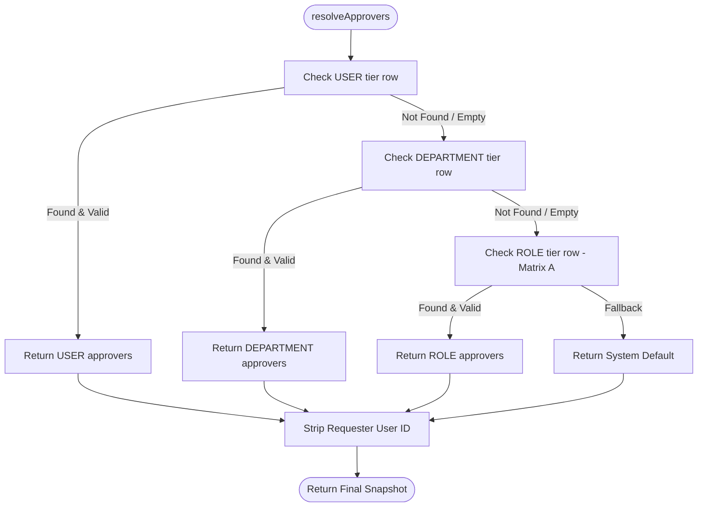

# NexAlliance HRM - Module 5: Approval & Reporting Matrix Documentation

## 1. Introduction & Purpose
Module 5 implements the dynamic **Approval & Reporting Matrix** for the **NexAlliance Enterprise HRM System**.
It provides:
- **3-Tier Precedence Engine**: Replaces hardcoded approver lookups with a dynamic hierarchy:
  1. `USER` Tier (Specific Employee Mapping)
  2. `DEPARTMENT` Tier (Department Head / Mapping)
  3. `ROLE` Tier (Matrix A Role Defaults: Employee $\rightarrow$ CEO+CTO, CTO $\rightarrow$ CEO, CEO $\rightarrow$ CTO)
- **Regularization Lock Guard**: Permanently locks Regularization approval to Super Admin only (`is_locked: true`).
- **Config-Time & Runtime Self-Approval Prevention**: Disallows employees from being configured as their own approver and strips requester IDs at runtime.
- **Super Admin Emergency Override**: Allows Super Admin to immediately approve or reject pending leave requests with mandatory reason auditing (`PUT /api/leaves/:id/override-decision`).
- **Pending Approvals Queue**: Returns the exact pending approvals awaiting action by the authenticated user (`GET /api/approvals/pending-for-me`).

---

## 2. Schema Architecture (`ApprovalMatrix`)

```javascript
const approvalMatrixSchema = new mongoose.Schema({
  requester_type: { type: String, enum: ['USER', 'DEPARTMENT', 'ROLE'], required: true },
  requester_ref:  { type: mongoose.Schema.Types.ObjectId, required: true }, // User._id, Department._id, or Role._id
  module:         { type: String, enum: ['LEAVE', 'REGULARIZATION'], required: true },
  level_no:       { type: Number, default: 1 },
  approvers: [{
    approver_type: { type: String, enum: ['USER', 'ROLE'], required: true },
    approver_ref:  { type: mongoose.Schema.Types.ObjectId, required: true } // User._id or Role._id
  }],
  rule:      { type: String, enum: ['ALL', 'ANY'], default: 'ALL' },
  is_active: { type: Boolean, default: true },
  is_locked: { type: Boolean, default: false } // True only for seeded Regularization row
}, { timestamps: true });

approvalMatrixSchema.index({ requester_type: 1, requester_ref: 1, module: 1 }, { unique: true });
```

---

## 3. Precedence Resolution Algorithm

When a user applies for Leave or Regularization, `resolveApprovers(userId, module)` executes:



---

## 4. API Endpoints

| HTTP Method | Route | Access Level | Description |
|---|---|---|---|
| `GET` | `/api/approval-matrix` | `SUPER_ADMIN`, `CEO`, `CTO` (`ALL`) | View configured approval matrix mappings |
| `POST` | `/api/approval-matrix` | `SUPER_ADMIN` ONLY | Create mapping (USER / DEPARTMENT / ROLE) |
| `PUT` | `/api/approval-matrix/:id` | `SUPER_ADMIN` ONLY | Update mapping (Blocked if `is_locked: true`) |
| `DELETE` | `/api/approval-matrix/:id` | `SUPER_ADMIN` ONLY | Soft deactivate mapping (Blocked if `is_locked: true`) |
| `GET` | `/api/approvals/pending-for-me` | All Authenticated | Get pending leave requests awaiting caller's decision |
| `PUT` | `/api/leaves/:id/override-decision` | `SUPER_ADMIN` ONLY | Emergency override decision (`APPROVED` / `REJECTED`) |

---

## 5. Security & Governance Rules

1. **Regularization Permanently Locked**:
   - `module: 'REGULARIZATION'` cannot be created, updated, or deleted via API (`400 Bad Request`).
   - The seeded row has `is_locked: true`.
2. **No Self-Approval**:
   - At config time: Rejected with `400 Bad Request` if requester is in approvers list.
   - At runtime: Requester ID is unconditionally stripped.
3. **Audit Trail**:
   - All matrix mutations and emergency override actions write an immutable `AuditLog` entry.
